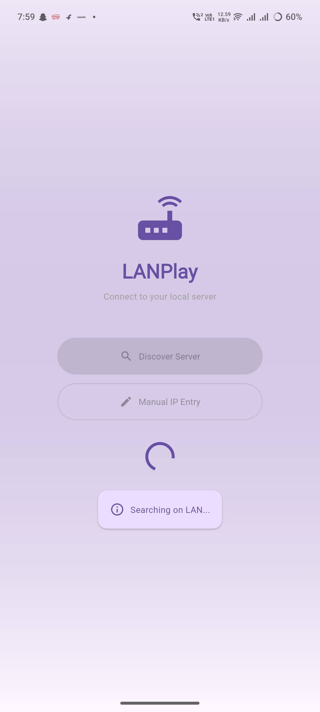
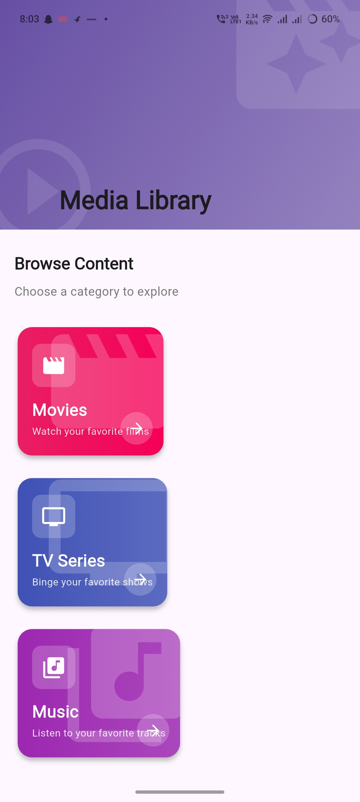
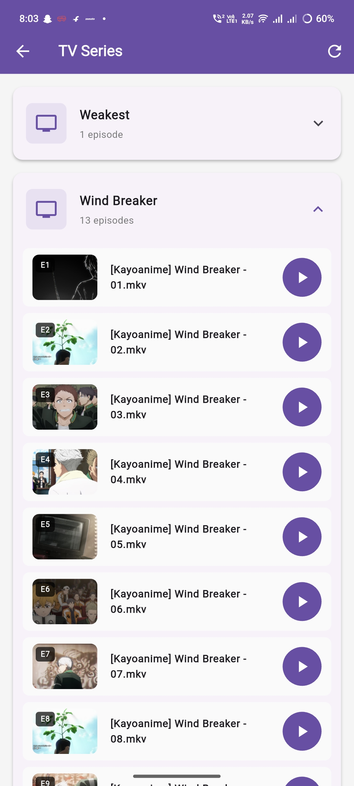

  

# 📺 LAN Media Server

A **lightweight LAN-based media server** with:

-   🌐 Minimal **web UI**
    
-   📱 **Android app** for LAN playback
    
-   ⚡ Fast local streaming with automatic discovery
    

This project is designed to work **entirely inside your local network (LAN)**.

----------

## ✨ Features

-   Minimal **web-based UI**
    
-   **Android app** with LAN auto-discovery (mDNS)
    
-   Manual IP address entry supported
    
-   Media auto-scanning & preloading
    
-   Supports **Movies, Series, Music**
    
-   No cloud, no login, no tracking
    

----------

## 🖥️ Frontend (Web UI)

The web UI is served directly by the backend.

### 🔗 Access URL

`http://<IP_ADDRESS>:8080/static/index.html` 

**Examples:**

`http://localhost:8080/static/index.html
http://192.168.1.7:8080/static/index.html` 

### 📸 Screenshots

WEB UI screenshots:

  

----------

## 📱 Android App

The Android app is available on the **Releases** page.

### 🔹 App Features

-   Auto-discovers the server using **mDNS**
    
-   Manual IP address entry if discovery fails
    
-   Optimized for LAN playback
    

### 🧭 App Flow

1.  Launch the app
    
2.  Home page opens
    
3.  App auto-discovers server IP via **mDNS**
    
4.  If not found, enter the IP address manually
    
5.  Start browsing and playing media
    

### 📸 Screenshots

Android app screenshots:

    

----------

## 🧠 Backend Setup

### ▶️ Start the Server

The server is distributed as a **single bundled Node.js file** with startup scripts.

You only need to provide **one value** at startup:

-   `MEDIA_ROOT` → Path to your media directory
    

#### 🐧 Linux / macOS

`./start.sh /path/to/media` 

#### 🪟 Windows (PowerShell)

`.\start.ps1 "D:\Media"` 

> First run only:

`Set-ExecutionPolicy  -Scope  Process  -ExecutionPolicy Bypass` 

#### 🪟 Windows (CMD)

`start.cmd D:\Media` 

----------

### 📂 Media Directory Structure (IMPORTANT)

The server will auto-create folders if missing.

`MEDIA_ROOT/ ├── Movies/ ├── Series/ ├── Music/ └── thumbnails/` 

Place your media files inside these folders.

**📌 Example**

`Movies/
├── Interstellar.mkv
└── Inception.mp4

Series/
└── BreakingBad/
 ├── episode1.mkv
    └── episode2.mkv 
Music/
└── Song.mp3` 

----------

### ⏳ First-Time Startup Notice (IMPORTANT)

After starting the server:

**⏱ Wait 30 seconds to 2 minutes before using the app**

**Reason:**

-   Media scanning
    
-   Metadata loading
    
-   Thumbnail generation
    
-   Cache creation
    

Using the app before preload finishes may show incomplete data.

----------

## 📡 Network Requirements

-   Server and client must be on the **same LAN**
    
-   Firewall should allow local traffic on **port 8080**
    
-   mDNS is optional (manual IP entry always works)
    

----------

## 🧪 Tested On

-   ✅ Windows
    
-   ✅ Linux
    
-   ✅ Android (LAN only)
    

----------

## 🛠️ Backend Platform Support

The backend can be run on:

-   ✅ Linux
    
-   ✅ Windows
    
-   ✅ Termux (Android)
    

### 🔧 ffmpeg Requirement (IMPORTANT)

You **must** install `ffmpeg` before running the server (thumbnail generation depends on it).

**Linux:**

`sudo apt install ffmpeg` 

**Windows:**

-   Download from [https://ffmpeg.org](https://ffmpeg.org)
    
-   Add `ffmpeg` to PATH
    

**Termux:**

`pkg install ffmpeg` 

----------

## 🚀 Future Improvements

-   Incremental scanning
    
-   Real-time file watcher
    
-   Subtitle support
    
-   Better series grouping
    
-   Playback resume
    

----------

## 🛠️ Tech Stack

-   **Backend:** Node.js + Express
    
-   **Frontend:** Minimal HTML / CSS / JavaScript
    
-   **Android:** Flutter
    
-   **Discovery:** mDNS
    
-   **Media Processing:** ffmpeg (thumbnails)
    

----------

## 🤝 Contributions

Pull requests are welcome.

This project is built for **local-first media consumption**.

----------

## ⚖️ License

This project is licensed under the MIT License.  
See the [LICENSE](LICENSE) file for details.